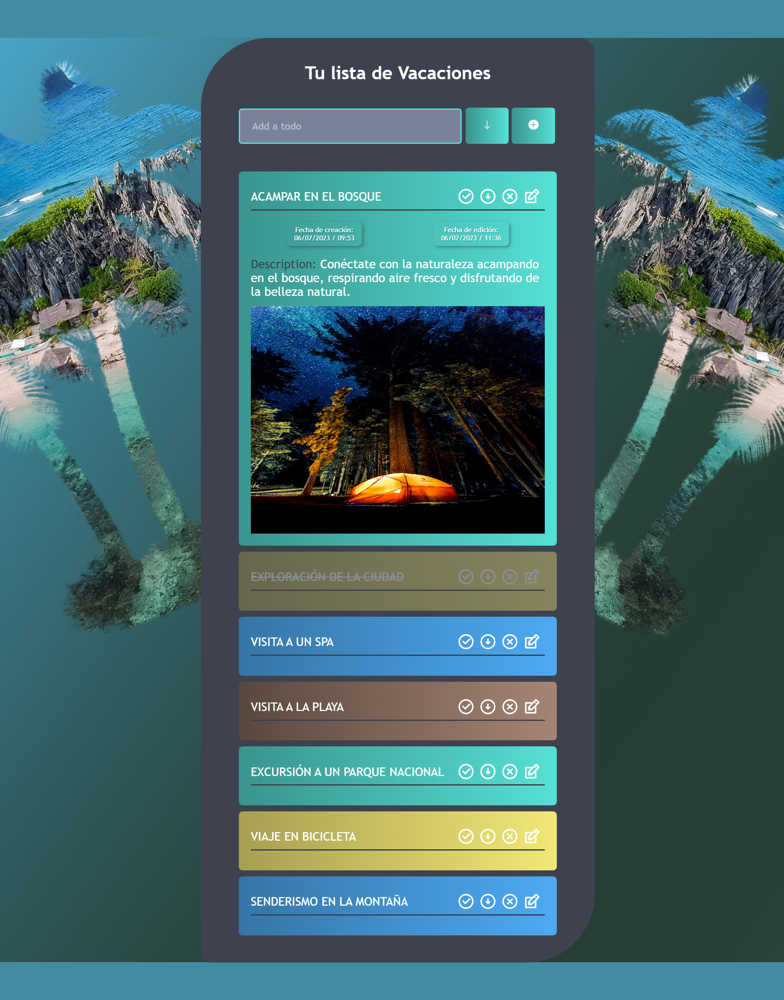

# Nombre del Proyecto 📋

"**Lista de Vacaciones:** se trata de una aplicación web que permite a los usuarios crear y administrar listas de vacaciones. Los usuarios pueden crear listas de tareas para cada día de sus vacaciones, agregar notas para cada tarea y marcar las tareas como completadas cuando estén terminadas. 😀

<div style="text-align: center; padding: 10px; display:flex flex-direction:column">
    <h1 style="font-size:25px; text-decoration-line: underline;">Version Escritorio 💻</h1>
    <div style="display:flex; flex-wrap: wrap; gap:5px; justify-content: center;">
    
    </div>
    <h1 style="font-size:25px; text-decoration-line: underline;">Version Mobile 📱</h1>
    <div style="display:flex; flex-wrap: wrap; gap:5px; justify-content: center;">
    
    </div>
    
</div>

# Link Proyecto

<div style="display: flex; flex-direction: column; align-items: center;">
    
    <a style="color: blue; font-size: 20px; display: block; text-align: center;" href="https://holidays-9fz.pages.dev/" target="_blank">Lista de Vacaciones</a>
</div>

## Instalación ⚙️

1. Asegúrese de tener instalado Node.js en su computadora. Si no lo tiene instalado, puede descargar e instalar **Node.js** en el sitio web oficial de Node.js.

2. Descargar o clonar el repositorio del proyecto desde GitHub.

3. Abrir una terminal o línea de comandos en la carpeta raíz del proyecto.

4. Ejecutar el comando npm install para instalar todas las dependencias necesarias del proyecto, incluyendo:

   -  <a href="https://www.npmjs.com/package/axios">axios</a>
   -  <a href="https://www.npmjs.com/package/react">react</a>
   -  <a href="https://www.npmjs.com/package/react-dom">react-dom</a>
   -  <a href="https://www.npmjs.com/package/react-icons">react-icons</a>
   -  <a href="https://www.npmjs.com/package/react-fetch-hook">react-fetch-hook</a>
   -  <a href="https://www.npmjs.com/package/react-router-dom">react-router-dom</a>
   -  <a href="https://www.npmjs.com/package/react-scripts">react-scripts</a>
   -  <a href="https://www.npmjs.com/package/web-vitals">web-vitals</a>

   ```
   npm install
   ```

   Este comando creará un archivo package.json en la carpeta de su proyecto. Este archivo contendrá información sobre su proyecto y las dependencias que se instalarán.

5. **"A tener en cuenta":** debes seguir los pasos de instalación del backend para configurar las rutas correspondientes en tu proyecto de React para hacer solicitudes al servidor. Además, es importante tener en cuenta que la configuración del backend esta alojada **en la rama "[backend](https://gitlab.com/Willydmq/holidays/-/tree/backend?ref_type=heads)" de este proyecto** para poder acceder a ella y poder conectarla al proyecto de React.

6. Una vez completados los pasos anteriores, ejecutar el comando npm start para iniciar la aplicación en el entorno de desarrollo.
   ```
   npm start
   ```
7. Acceder a la URL http://localhost:3000 en un navegador web para ver la aplicación en funcionamiento.

### Requisitos 📄

1. Conocimientos: en CSS, **JavaScript y ReactJS**.

2. Conocimientos de Git: La aplicación utiliza Git para el control de versiones, por lo que necesitará conocimientos básicos de Git para clonar el repositorio del proyecto, crear ramas, fusionar cambios y enviar solicitudes de extracción.

## Uso 💪

La App esta enfocadad a cualquier persona que planee unas vacaciones y quiera mantener un registro de las tareas que deben realizar durante su tiempo libre. La aplicación también puede ser útil para grupos de personas que viajan juntas, ya que pueden compartir sus listas de tareas y mantenerse organizados durante sus vacaciones.

## Construido con 🛠️

<div style="text-align: center; padding: 10px;">
    
</div>

## Deployment 🚀

El patrón de diseño principal para el proyecto de Lista de Vacaciones es la arquitectura basada en componentes de **React**, con enrutamiento basado en componentes y una arquitectura **cliente-servidor** que utiliza solicitudes HTTP para intercambiar datos entre el frontend y el backend.

## Autores ✒️

- **William Maldonado** - _Project Integration & S.O.L.I.D_ - [Willydmq](https://gitlab.com/Willydmq)

## Expresiones de Gratitud

- Quiero agradecer a **CoreCode** por brindarme la oportunidad de trabajar en proyectos emocionantes y desafiantes. Gracias por proporcionarme un entorno de trabajo en el que puedo crecer y desarrollar mis habilidades como programador. 🤓.
- Expresar mi gratitud a los **tutores** que me han ayudado en cada paso del camino. Gracias por compartir sus conocimientos y experiencia conmigo, y por ayudarme a superar los obstáculos que he enfrentado en este proyecto. 📢.
- Por último, quiero agradecer a todas las personas que me han apoyado y motivado a lo largo de mi carrera. Gracias por creer en mí y por alentarme a seguir adelante incluso cuando las cosas se ponen difíciles. Vuestra apoyo ha sido fundamental para mi éxito hasta ahora, y estoy muy agradecido por ello.

¡Gracias de nuevo a **CoreCode, los tutores y a todas las personas** que me han apoyado y motivado en mi carrera! 🌟.

---

⌨️ con ❤️ por [William Maldonado](https://gitlab.com/Willydmq) 😊

---
